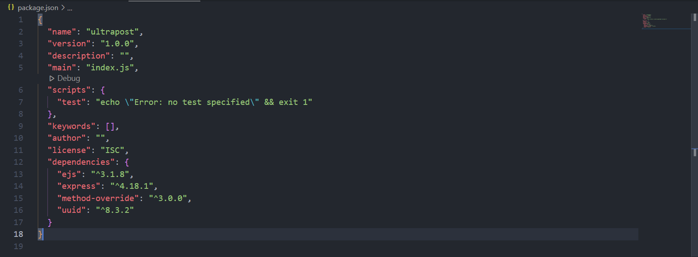

## I'm a Web Developer

- 👋 Hi, I’m `Ali Reza Samadi`
- 👀 I’m interested in Coding
- 🌱 I’m currently learning NODEJS
- 📫 Follow me on [Twitter][twitter]

### Introduction
My Name is `Ali Reza`, and it’s been 1.5 years that I’m Coding and has learnt so many things. I know that for the first time, you get overwhelm while Coding, I was just like you, but if you keep going, You’ll get used to it, and you’ll enjoy alot while Coding (LIKE ME hhh). So, I’m here to make it easy for you, and I want you to come with me...

<hr>

### About this Website
This Website is all about Downloading Movie, but it's fake, I just made it for practising.
The tools that I used to make this Full Responsive Website:
- HTML
- Pure CSS
- JS
- [NODEJS][nodejs]
  - [Express][express]
    - [Method-Override][method-override]
  - [EJS][ejs]
  - [UUID][uuid]

<hr>


## How does this website work?

### Installing NODEJS
We need `NPM` in order for this Project to work, Without NODEJS -- The project isn't going to work.

### Installing Several files from Package Managers.
There is no need to Install them separately, I wrote the dependencies for you, Just run this in your terminal, It'll download for you.
```console
$ npm install
```



[twitter]: twitter.com/webDeveloper83
[nodejs]: https://nodejs.org/en/
[express]: http://expressjs.com/
[method-override]: http://expressjs.com/en/resources/middleware/method-override.html
[ejs]: https://ejs.co/
[uuid]: https://www.npmjs.com/package/uuid
